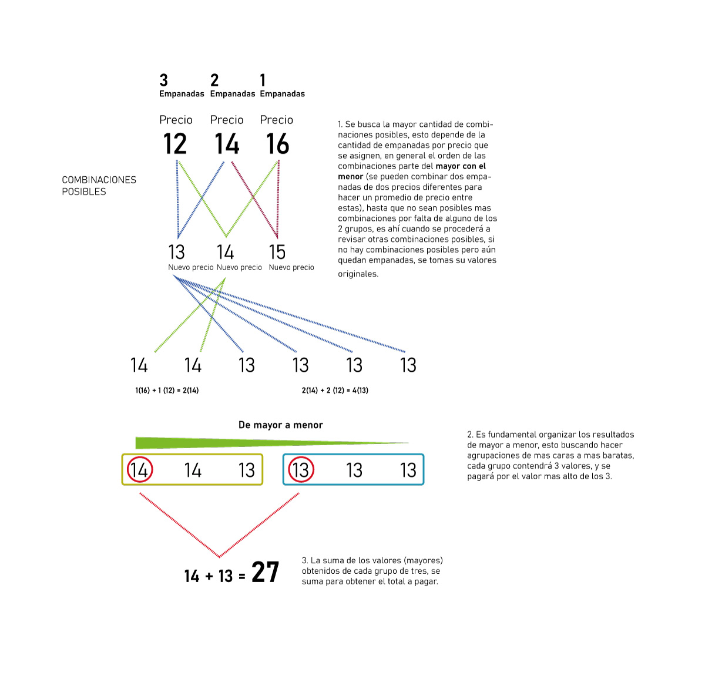

# Compra de empanadas 

## Enunciado del problema

El profesor Maple se embarca en la tarea de adquirir empanadas para todos los participantes del bootcamp de programación. Dado que hoy es el Día de las Empanadas,  hay una oferta especial en la que te llevas hasta tres empanadas y solo pagas la más cara. Con un presupuesto ajustado para el curso, los profesores debaten para intentar minimizar el gasto total por todas las empanadas.

Entonces, el profesor Maple decide seguir la siguiente estrategia: como la empanada más cara la tendrá que pagar de todas formas, la comprará junto a la segunda y tercera más caras, que ofrecen el mayor ahorro. Con las n-3 empanadas restantes, aplicará el mismo procedimiento hasta que no quede ninguna.

Los profesores reflexionan y llegan a la conclusión de que esta es la mejor estrategia. Pero cuando están a punto de pagar, escuchan la siguiente conversación de una familia de al lado:

"Queremos una empanada de pollo, de 12 euros, una de carne, de 14 euros, y una vegetariana, de 16 euros."

Los profesores piensan inmediatamente: "Cogerán la oferta 3x1, de forma que solo paguen los 16 euros de la empanada vegetariana y se lleven gratis la de carne y la de pollo". A lo cual, la familia continúa:

"Pero pónganosla de la siguiente forma: Dos empanadas mitad pollo y mitad vegetariana, y la de carne aparte. Como todas las empanadas valen 14 euros, cogeremos la oferta 3x1 y nos las llevaremos por 14 euros".

Cuando los profesores salen de su asombro, deciden que lo más sensato es utilizar el hecho de que las empanadas se pueden pedir mitad de un tipo y mitad de otro, pagando por ella la media del costo de las dos empanadas enteras. Así, una empanada mitad pollo y mitad vegetariana valdrá (12 + 16)/2 = 14 euros. Sin embargo, no logran decidir cuál es la mejor forma de repartir las empanadas en mitades primero, y en grupos después, para minimizar el precio.

Ayúdales haciendo una función que lo calcule lo más rápido posible: hay decenas de estudiantes hambrientos que dependen de ti.

Las empanadas que han elegido los profesores tienen 3, 4 o 5 ingredientes. La masa de una empanada vale 6 euros, y cada ingrediente adicional vale 2 euros. Así, las empanadas pueden valer 12, 14 o 16 euros. Se garantiza que el número total de empanadas será múltiplo de 3.

## Entrada

La función debe tener tres parámetros de entrada. Cada conjunto de entrada consta de tres enteros, a b c, que son el número de empanadas de 3, 4 y 5 ingredientes, respectivamente. Se garantiza que el número de empanadas, a + b + c, cumple que a + b + c < 40. Además, el número de empanadas es divisible entre 3.

## Salida

Por cada conjunto de entrada, retornar un único entero: la mínima cantidad de euros que se puede pagar para llevarse todas las empanadas.

## Ejemplos de casos de uso

| Entrada     | Salida      |
| ----------- | ----------- |
| 1, 1, 1     | 14          |
| 3, 3, 0     | 26          |
| 2, 0, 1     | 14          |
| 9, 10, 11   | 142         |


## Proceso de Resolucion del problema


Durante el proceso de resolución del problema, se toma inicialmente un espacio en donde se plantea sobre papel y lápiz cuál puede ser la solución más eficiente antes de esta situación y que satisfaga plenamente la solicitud; así pues, se exploran múltiples caminos, entre estos se revisa si priorizar la agrupación por precios sin intervenir demasiado en las combinaciones podría llegar a la resolución satisfactoria, pero en general se obtienen peores datos, por ende más a pagar, así que entre unas posibles resoluciones y otras se llegó a la definitiva, una vez se define el modelo estructurado se procede a programar la función.

La función tiene tres fases esenciales:
1. Verificaciones iniciales, donde se valida que los datos ingresados cumplan unos requerimientos mínimos, como son: que la suma de a + b + c no sea mayor a 40 y esta suma también tiene que ser múltiplo de 3, también que no puede haber números negativos en los datos de entrada y, por último, que los valores ingresados sean exclusivamente números.
2. Una vez obtenidos los datos de entrada y verificados que cumplen con los requisitos mínimos, se estructura un sistema que efectúa todas las combinaciones posibles. Cuando no hay más combinaciones posibles, pero aún quedan valores por incluir, se adicionan con su valor real (valor sin combinar). Cada uno de estos datos se almacena en un array, que posteriormente será organizado de mayor a menor. Esta parte es fundamental porque es lo que nos permitirá poder asegurarnos de que siempre se van a tomar el mayor número posible.
3. Una vez que se tiene el array con todos los valores, se itera sobre sí buscando el valor cada 3, con el objetivo de dividir en grupos de tres, lo cual corresponde a lo solicitado en el enunciado del problema. Estos nuevos valores obtenidos se almacenan en un array nuevo para posteriormente ser sumados; este valor resultante será el total a pagar.


A continuación un diagrama de su resolución.



## Instrucciones de uso

1. Clonar el repositorio
3. Instalar las dependencias:

    ```bash
    npm install
    ```

4. Completar los argumentos y el cuerpo de la función `fn` en el archivo (`main.js`). No se debe renombrar la función `fn`.

    ```javascript
    // main.js
    export const fn = (/* argumentos de la función */) => {
    // Cuerpo de la función: Completa la lógica de la función aquí.
    };
    ```

4. Ejecutar los test:
    ```bash
    npm run test
    ```

## Evaluación

### Mínimo
Para el APTO se deben pasar todos los test excepto los de validaciones de errores en la entrada de datos

### Extra
Pasar los test de validación de errores en la entrada de datos (Throws error)

### Ejemplo de ejecución de algunos test

```bash
✓ main.test.js (7)
   ✓ Function fn - Input Parameter Test Cases (7)
     ✓ Case: fn(1, 1, 1) - Expected Result: 14
     ✓ Case: fn(3, 3, 0) - Expected Result: 26
     ✓ Case: fn(2, 0, 1) - Expected Result: 14
     ✓ Case: fn(9, 10, 11) - Expected Result: 142
     ✓ Throw error on negative input value: fn(-1, 3, 1)
     ✓ Throws error when the total sum of inputs (2+2+1) is not a multiple of 3: fn(2, 2, 1)
     ✓ Throws error when the total sum of inputs (15+15+20) is not less than 40: fn(15, 15, 20)
```

 
